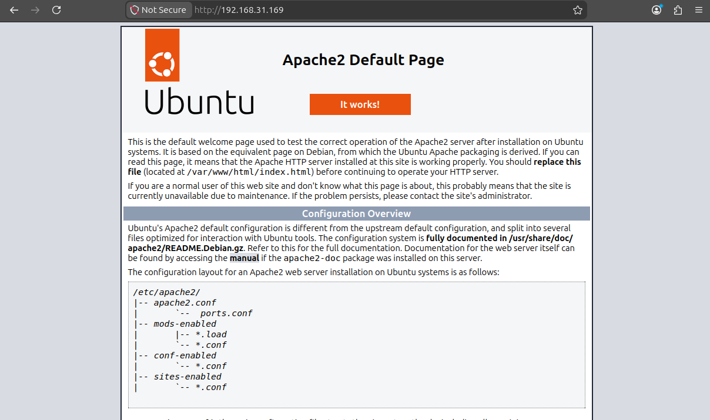
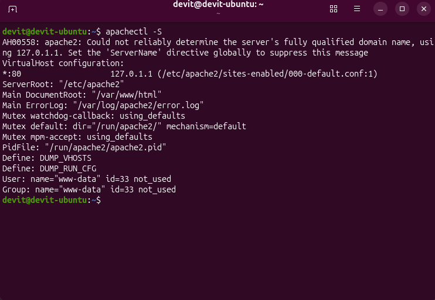
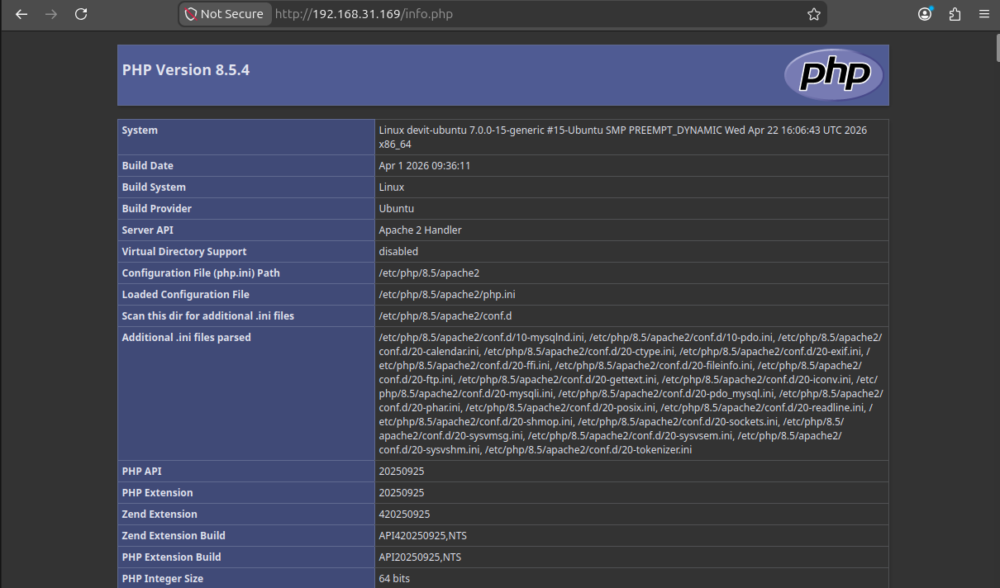
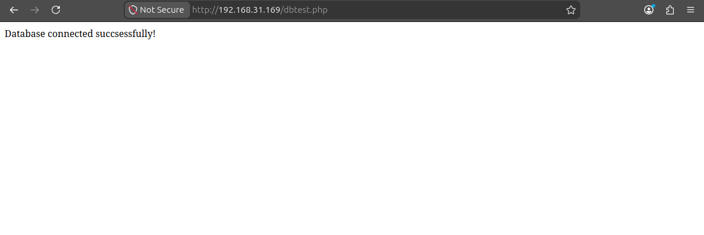
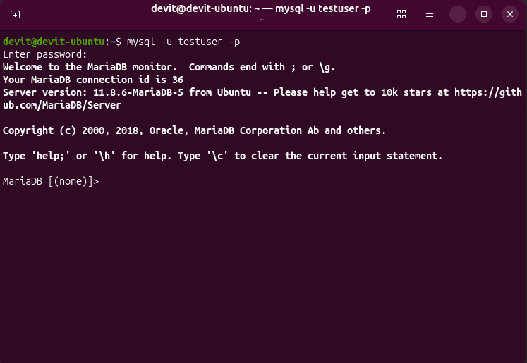
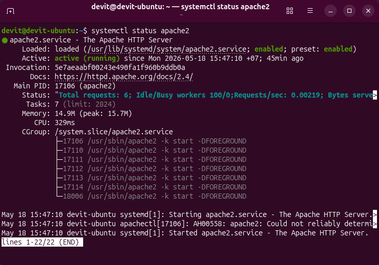

# LAMP Stack Lab

This project demonstrates a working LAMP stack setup on Ubuntu:
Linux + Apache + MariaDB + PHP

---

##  Stack

- Ubuntu Linux
- Apache2
- PHP 8+
- MariaDB

---

##  Features

- Apache web server setup
- PHP integration
- Database connection (MariaDB)
- PHP ↔ DB working example

---

##  Project Screenshots

### Apache running web server

### Apache configuration check

### PHP execution

### MariaDB connection

### MySQL login

### Apache service status

